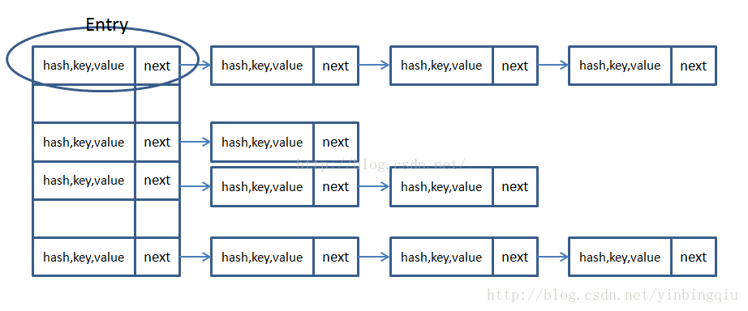

# JS去重

- 排序，遍历顺序比较，不同就push到新数组

```
let c=[1,2,3,4,5,6,1,2,3]
function unique(arr){
    let Arr=arr.sort()
    let b=[]
    for(let i=0;i<Arr.length;i++){
        if(Arr[i]!==Arr[i+1]){
            b.push(Arr[i])
        }
    }
    return b
}
```

- indexOf遍历

```
let c=[1,2,3,4,5,6,1,2,3]
function unique(arr){
    let b=[]
    for(let i=0;i<arr.length;i++){
        if(b.indexOf(arr[i])==-1){
            b.push(arr[i])
        }
    }
    return b
}
```

- map()/forEach()
- set

```
let c=[1,2,3,4,5,6,1,2,3]
function unique(arr){
    let b=new Set(arr)
    let c=Array.from(b)
    return c
}
```

# 递归regression

## Fibonacci 

```c
//迭代，number=40,time=1ms
int Fibonacci(int number) {
	if (number <= 0) {
		return 0;
	}
	if (number == 1 || number == 2) {
		return 1;
	}
	int first = 1, second = 1, third = 0;
	for (int i = 3; i <= number; i++) {
		third = first + second;
		first = second;
		second = third;
	}
	return third;
}
//regression n=40,time=272ms
public int Fibonacci(int n) {
	if (n <= 0) {
        return 0;
	}
    if (n == 1||n==2) {
        return 1;
    }
    return Fibonacci(n - 2) + Fibonacci(n - 1);
}
```

## 变种：青蛙跳台阶

# 数据结构

## 链表

## 翻转链表

## 有序链表合并

```java
public ListNode Merge(ListNode list1,ListNode list2) {
	if(list1 == null){
		return list2;
    }
    if(list2 == null){
        return list1;
    }
    if(list1.val <= list2.val){
        list1.next = Merge(list1.next, list2);
        return list1;
    }else{
        list2.next = Merge(list1, list2.next);
        return list2;
    }       
}
```

##  堆和队列

## 用队列实现堆栈


## 用堆栈实现队列


# Sorting

# HTTPS的认证过程


## TCP/IP

三次握手


# Java基础

## HashMap实现原理

HashMap是**拉链**(Hash再散列的一种方式)的一种实现方式（JDK1.7之前，以及1.8以后，阈值小于8），左边一列为数组（位桶数组），右边为链表（Entry链，通过equal判断）



Hashmap在JDK1.8，阈值大于8后，采用红黑树

```java
static final class TreeNode extends LinkedHashMap.Entry {
    TreeNode parent;  // 父节点
    TreeNode left; //左子树
    TreeNode right;//右子树
    TreeNode prev;    // needed to unlink next upon deletion
    boolean red;    //颜色属性
    TreeNode(int hash, K key, V val, Node next) {
        super(hash, key, val, next);
    }
  //返回当前节点的根节点
    final TreeNode root() {
        for (TreeNode r = this, p;;) {
            if ((p = r.parent) == null)
                return r;
            r = p;
        }
    }
```

## HashMap，HashTable，ConcurrentHashMap

！！可能有错，还未梳理完成

|          | hashmap    | hashtable  | concurrentHashMap |
| -------- | ---------- | ---------- | ----------------- |
| 底层     | 数组+链表  | 数组+链表  | 数组+链表         |
| 线程安全 | √          | ×          | ×                 |
| null     | kv不能为空 | kv可以为空 |                   |
| 初始大小 | 11         | 16         |                   |
| 扩容     | 2*old+1    | old*2      |                   |
|          |            |            |                   |

## Redis

使用场景

- 缓存
- 登录session

feature：

- 基于内存（快的原因）
- 数据结构简单（set hash list zset）
- 单线程，避免不必要的上下文切换和竞争条件，没有锁，多路I/O复用，非阻塞（和Nodejs一样）

# 分布式

## Kafka优缺点

- 高吞吐量的消息队列，基本组件：消费者，生产者，node节点等
- 副本………………

# 概念

## 幂等性

> 数学上，对于x，有f(x)=f(f(x))，则成为幂等性

在分布式环境下，表示对同样的请求，在一次或者多次请求的情况下，对系统的使用资源是一样的，保证失败重试不会导致提交两次

## 堆栈内存

堆内存：是线程共享的,new

栈内存：线程私有的,基本类型的变量和对象的引用变量


# 数据库

## 事务Transaction

是一个操作序列，不可分割的工作单位，以begin transaction开始，以rollback/commit结束

| 特性              | Desc             |
| ----------------- | ---------------- |
| 原子性Atomicity   | 全对或回滚       |
| 一致性Consistency | 多次事务结果相同 |
| 隔离性Isolation   | 事务间互不影响   |
| 持久性Durability  | 一但成功即永久   |

## 并发一致性问题

- 丢失修改，后事务对一个未完成事务修改覆盖
- 脏读，后事务对一个未完成事务修改过的数据读
- 不可重复读，后事务读取过程中数据被修改
- 幻读，类似不可重复，区别于是插入操作修改

## 四种隔离级别

- 未提交读
- 提交读
- 可重复读（MYSQL默认隔离级别）
- 可串行化（事务全部串行，效率低）

## 乐观锁&悲观锁

悲观锁：先锁再操作，适合数据修改频繁场景

乐观锁：先读，读的时候在判断是否有事务再更新，有则重读（通过加版本号或者时间戳作为字段为判断依据，缺点就是每次数据更新都需要更新这个字段）

## 封锁类型

- 排它锁X
- 共享锁S 只读共享
- 意向锁

## 三级封锁协议（待补充，不重要）

- 一级，X
- 二级
- 三级

## 数据库索引的实现原理（B+树）

innoDB中使用的B+树

- IO次数少，B+树中间节点存储索引，数据在叶子节点中
- 查询B树要遍历，B+只需要遍历叶子节点

why 选择B+

- 效率比O(1)好
- B树索引支持大小比较，范围查找

innodb和myISAM区别

- innodb支持事务
- myisam仅有表级锁，innodb表+行锁
- innodb支持外键
- innodb在线热备份

## **数据库优化**

### SQL优化

该部分基本需要遵守一些准则，合理利用索引

- 避免!=,>,<,null的判断（索引失效）
- 返回必要的列，减小select * (graphQL解决方案)
- Limit限制

### 索引优化（主）

- 建立合适的索引，不能太多，也不能太少（太少全表检索用不到索引，太多就冗余，索引可能比数据还多？）

### 表结构优化

- 范式遵循（默认3）
- 选择合适类型，尽可能不要存储null
- **水平切分**，根据哈希取模，将一个表水平切分，当一个表中数据增多时，sharding，将数据分不到集群的不同节点上
- **垂直切分**，将不常用的字段独立放一个表中

### 配置优化

- 增加TCP支持的队列
- MYSQL配置缓存池大小
- etc

### 硬件优化（次）

- 磁盘性能
- CPU
- 内存

## 主从复制Replication

将数据从一个mysql中复制到其他服务器中，默认异步同步

- 主服务器binary log dump线程将数据更改写入日志
- 从服务器IO线程读取数据修改日志，写入本地relaylog
- 从服务器SQL线程，读取relaylog解析并执行

why选择主从复制

- 读写分离，主写从读

  - 缓解锁竞争

  - 从使用myisam提升查询性能


  - 数据实时备份

  - 降低单个IO访问频率（显然）


## 索引分类

- 普通索引
- 唯一索引，索引值唯一，可空
- 主键索引，唯一不可空
- 复合索引
- 覆盖索引
- 聚集索引
- 分区索引
- 虚拟索引

## MVCC

multi-version concurrency control

每行记录后面保存两个隐藏的列用来存储版本号和删除版本号

- 创建版本号：创建数据时的事务版本号
- 删除版本号：同上

## 范式

依次严格

- 第一范式：不存在可分的列
- 第二范式：主键
- 第三范式（默认）外键
- 第

## 表连接方式

内连接：满足连接条件的行组合起来（交集）

- 自然连接
- 等值连接

外连接：左连接，右连接，全连接

交叉连接：笛卡尔积，即m*n

## 存储过程

存储过程是事先经过编译并存储在数据库中的一段**SQL语句的集合**。

想要实现相应的功能时，只需要调用这个存储过程就行了（类似于函数，输入具有输出参数）。

优点：

- 预先编译，效率高
- 封装操作减少网络通信
- 可复用
- 安全性高，可以让低权限用户直接调用
- 易维护

缺点（可以忽略）：

- 移植性差
- 调试复杂
- 修改复杂

## 删除命令

- delete删除全表数据或部分数据，触发日志，可还原
- truncate清空所有数据不可回滚，自增重置为1，无日志
- drop删除数据，表，索引，约束不能回滚，无日志

## 视图

取出来的数据可视化，操作不影响数据库中数据

```sql
CREATE VIEW view_name AS
SELECT column_name(s)
FROM table_name
WHERE condition
```

## 游标

定位查询返回结果集中的特定行，以对特定行进行操作，分普通游标和滚动游标（了解，应用不多）


## ACID特性


原子性：

一致性：

隔离性：

持久性：

## 如何rollback

写入前会有redo log和undo log，如果失败会逆向还原到事务开始之前

# 灵魂拷问

## Java多线程

- 线程池的原理，为什么要创建线程池？
- 线程的生命周期，什么时候会出现僵死进程；
- 什么实现线程安全，如何实现线程安全；
- 创建线程池有哪几个核心参数？如何合理配置线程池的大小？
- synchronized、volatile区别、synchronized锁粒度、模拟死锁场景、原子性与可见性；

## JVM相关

- JVM内存模型，GC机制和原理；GC分哪两种；什么时候会触发Full GC？
- JVM里的有几种classloader，为什么会有多种？
- 什么是双亲委派机制？介绍一些运作过程，双亲委派模型的好处；(这个我真的不会...)
- 什么情况下我们需要破坏双亲委派模型；
- 常见的JVM调优方法有哪些？可以具体到调整哪个参数，调成什么值？
- JVM虚拟机内存划分、类加载器、垃圾收集算法、垃圾收集器、class文件结构是如何解析的；

## Java扩展

- 红黑树的实现原理和应用场景；
- NIO是什么？适用于何种场景？
- Java9比Java8改进了什么；
- HashMap内部的数据结构是什么？底层是怎么实现的？
- 说说反射的用途及实现，反射是不是很慢，我们在项目中是否要避免使用反射；
- 说说自定义注解的场景及实现；
- List和Map区别，Arraylist与LinkedList区别，ArrayList与Vector 区别；

## Spring

- Spring AOP的实现原理和场景；（应用场景很重要）
- Spring bean的作用域和生命周期；
- Spring Boot比Spring做了哪些改进？Spring 5比Spring4做了哪些改进；（惭愧呀，我们还在用Spring4，高版本的没关心过）
- Spring IOC是什么？优点是什么？
- SpringMVC、动态代理、反射、AOP原理、事务隔离级别；

## 中间件

- Dubbo完整的一次调用链路介绍；
- Dubbo支持几种负载均衡策略？
- Dubbo Provider服务提供者要控制执行并发请求上限，具体怎么做？
- Dubbo启动的时候支持几种配置方式？
- 了解几种消息中间件产品？各产品的优缺点介绍；
- 消息中间件如何保证消息的一致性和如何进行消息的重试机制？
- Spring Cloud熔断机制介绍；
- Spring Cloud对比下Dubbo，什么场景下该使用Spring Cloud？

## 数据库

- 锁机制介绍：行锁、表锁、排他锁、共享锁；
- 乐观锁的业务场景及实现方式；
- 事务介绍，分布式事物的理解，常见的解决方案有哪些，什么事两阶段提交、三阶段提交；
- MySQL记录binlog的方式主要包括三种模式？每种模式的优缺点是什么？
- MySQL锁，悲观锁、乐观锁、排它锁、共享锁、表级锁、行级锁；
- 分布式事务的原理2阶段提交，同步异步阻塞非阻塞；
- 数据库事务隔离级别，MySQL默认的隔离级别、Spring如何实现事务、
- JDBC如何实现事务、嵌套事务实现、分布式事务实现；
- SQL的整个解析、执行过程原理、SQL行转列；

## Redis

- Redis为什么这么快？redis采用多线程会有哪些问题？
- Redis支持哪几种数据结构；
- Redis跳跃表的问题；
- Redis单进程单线程的Redis如何能够高并发?
- Redis如何使用Redis实现分布式锁？
- Redis分布式锁操作的原子性，Redis内部是如何实现的？