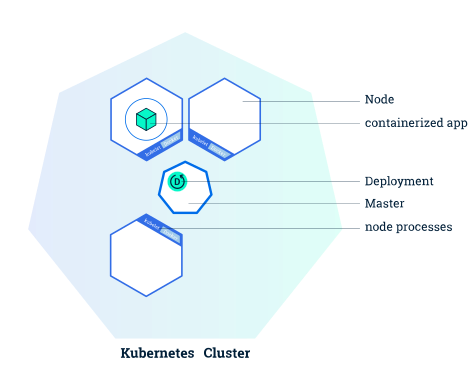

# 0.Hello Minikube

# 1.Basics

## 1.0 

## 1.1Create a Cluster


- master 管理cluster
- node 为工作节点，拥有kubelet（管理Node、与master沟通的agent）

minikube：提供k8s基本的操作，如start,stop,delete,status

minikube --help

minikube start


kubectl：与k8s交互，`kubectl controls the Kubernetes cluster manager`

kubectl --help

```shell
Basic Commands (Beginner):
  create         Create a resource from a file or from stdin.
  expose         Take a replication controller, service, deployment or pod and expose it as a new Kubernetes Service
  run            Run a particular image on the cluster
  set            Set specific features on objects

Basic Commands (Intermediate):
  explain        Documentation of resources
  get            Display one or many resources
  edit           Edit a resource on the server
  delete         Delete resources by filenames, stdin, resources and names, or by resources and label selector

Deploy Commands:
  rollout        Manage the rollout of a resource
  scale          Set a new size for a Deployment, ReplicaSet or Replication Controller
  autoscale      Auto-scale a Deployment, ReplicaSet, or ReplicationController

Cluster Management Commands:
  certificate    Modify certificate resources.
  cluster-info   Display cluster info
  top            Display Resource (CPU/Memory/Storage) usage.
  cordon         Mark node as unschedulable
  uncordon       Mark node as schedulable
  drain          Drain node in preparation for maintenance
  taint          Update the taints on one or more nodes

Troubleshooting and Debugging Commands:
  describe       Show details of a specific resource or group of resources
  logs           Print the logs for a container in a pod
  attach         Attach to a running container
  exec           Execute a command in a container
  port-forward   Forward one or more local ports to a pod
  proxy          Run a proxy to the Kubernetes API server
  cp             Copy files and directories to and from containers.
  auth           Inspect authorization

Advanced Commands:
  diff           Diff live version against would-be applied version
  apply          Apply a configuration to a resource by filename or stdin
  patch          Update field(s) of a resource using strategic merge patch
  replace        Replace a resource by filename or stdin
  wait           Experimental: Wait for a specific condition on one or many resources.
  convert        Convert config files between different API versions
  kustomize      Build a kustomization target from a directory or a remote url.

Settings Commands:
  label          Update the labels on a resource
  annotate       Update the annotations on a resource
  completion     Output shell completion code for the specified shell (bash or zsh)

Other Commands:
  api-resources  Print the supported API resources on the server
  api-versions   Print the supported API versions on the server, in the form of "group/version"
  config         Modify kubeconfig files
  plugin         Provides utilities for interacting with plugins.
  version        Print the client and server version information
```

$ kubectl cluster-info
Kubernetes master is running at https://172.17.0.14:8443
KubeDNS is running at https://172.17.0.14:8443/api/v1/namespaces/kube-system/services/kube-dns:dns/proxy

$ kubectl get nodes
NAME       STATUS     ROLES    AGE   VERSION
minikube   NotReady   master   9s    v1.17.3

## 1.2deploy an App

如果你配置了k8s Deployment configuration，你可以部署容器应用在k8s cluster上。当你配置了Deployment ，k8s master会schedule （按时？）通知cluster中所有的node节点上的应用。

当你的app 实例创建的时候，k8s Deployment Controller会持续监测，如果部署的节点故障，Deployment Controller会给app**重新换个节点**



你可以通过kubectl来create & manage Deployment，kubectl使用k8s API 来和cluster交互。

当你创建一个Deployment时候，你需要指定app所用的容器镜像和需要运行的副本`replcas`，当然也可以创建后更新这些信息

```shell
$ kubectl get nodes
NAME       STATUS     ROLES    AGE   VERSION
minikube   NotReady   master   15s   v1.17.3

$ kubectl create deployment kubernetes-bootcamp --image=gcr.io/google-samples/kubernetes-bootcamp:v1
deployment.apps/kubernetes-bootcamp created
//指定deploymentname 和image Location
//1.寻找合适node部署 2.准备部署 3.配置 新节点重启的配置

//kubectl可以创建proxy来对外暴露你的服务
$ kubectl proxy
Starting to serve on 127.0.0.1:8001

$ curl http://localhost:8001/version
{
  "major": "1",
  "minor": "17",
  "gitVersion": "v1.17.3",
  "gitCommit": "06ad960bfd03b39c8310aaf92d1e7c12ce618213",
  "gitTreeState": "clean",
  "buildDate": "2020-02-11T18:07:13Z",
  "goVersion": "go1.13.6",
  "compiler": "gc",
  "platform": "linux/amd64"
}
```

## 1.3 Explore App

###  **1.3.1Pods**

当你create Deployment时，k8s会创建一个Pod来托管app实例，Pod是k8s abstraction，代表一组（单个或多个）app 容器，共享资源，资源包括：

-  共享内存--->as Volumes
- 网络(as a unique cluster ip address)
- 信息（如何run each container）

pod可以关联多个app容器，将他们视作一个服务，他们有相同的ip地址，相同的端口，总是co-located & co-scheduled，并分享上下文

pods是k8s的最小单元，当你create deployment 时会创建pods，容器在pods内部，每个pods都绑定在刚创建的node上，直到node终止，如果node down则会在别的可用的node上部署相同的pod


### 1.3.2node

pod始终运行在node上。node是依赖于master，运行在vm或者物理机上的worker machine。一个node可以拥有多个Pods，并且被master管理者


### 1.3.3排除故障

- **kubectl get** - list resources
- **kubectl describe** - show detailed information about a resource
- **kubectl logs** - print the logs from a container in a pod
- **kubectl exec** - execute a command on a container in a pod

```
$ kubectl describe pods
Name:         kubernetes-bootcamp-765bf4c7b4-dnm2j
Namespace:    default
Priority:     0
Node:         minikube/172.17.0.10
Start Time:   Tue, 31 Mar 2020 05:54:38 +0000
Labels:       pod-template-hash=765bf4c7b4
              run=kubernetes-bootcamp
Annotations:  <none>
Status:       Running
IP:           172.18.0.5
IPs:
  IP:           172.18.0.5
Controlled By:  ReplicaSet/kubernetes-bootcamp-765bf4c7b4
Containers:
  kubernetes-bootcamp:
    Container ID:   docker://2c2a5074ee7c87a4bdfe6b73db2dab8168d407642e2c76df8edd56b45441ec0b
    Image:          gcr.io/google-samples/kubernetes-bootcamp:v1
    Image ID:       docker-pullable://jocatalin/kubernetes-bootcamp@sha256:0d6b8ee63bb57c5f5b6156f446b3bc3b3c143d233037f3a2f00e279c8fcc64af
    Port:           8080/TCP
    Host Port:      0/TCP
    State:          Running
      Started:      Tue, 31 Mar 2020 05:54:41 +0000
    Ready:          True
    Restart Count:  0
    Environment:    <none>
    Mounts:
      /var/run/secrets/kubernetes.io/serviceaccount from default-token-wk8gk (ro)
Conditions:
  Type              Status
  Initialized       True
  Ready             True
  ContainersReady   True
  PodScheduled      True
Volumes:
  default-token-wk8gk:
    Type:        Secret (a volume populated by a Secret)
    SecretName:  default-token-wk8gk
    Optional:    false
QoS Class:       BestEffort
Node-Selectors:  <none>
Tolerations:     node.kubernetes.io/not-ready:NoExecute for 300s
                 node.kubernetes.io/unreachable:NoExecute for 300s
Events:          <none>

kubectl logs $POD_NAME

//exec
$ kubectl exec $POD_NAME env
PATH=/usr/local/sbin:/usr/local/bin:/usr/sbin:/usr/bin:/sbin:/bin
HOSTNAME=kubernetes-bootcamp-765bf4c7b4-9xxqt
KUBERNETES_PORT_443_TCP_PROTO=tcp
KUBERNETES_PORT_443_TCP_PORT=443
KUBERNETES_PORT_443_TCP_ADDR=10.96.0.1
KUBERNETES_SERVICE_HOST=10.96.0.1
KUBERNETES_SERVICE_PORT=443
KUBERNETES_SERVICE_PORT_HTTPS=443
KUBERNETES_PORT=tcp://10.96.0.1:443
KUBERNETES_PORT_443_TCP=tcp://10.96.0.1:443
NPM_CONFIG_LOGLEVEL=info
NODE_VERSION=6.3.1
HOME=/root

$ kubectl exec -ti $POD_NAME bash
root@kubernetes-bootcamp-765bf4c7b4-9xxqt:/#
```

## 1.4 Explor App Public

pods具备生命周期，当worker节点 die的时候，其上的pods也会lost。副本集（replicaSet）会故障时创建新的Pods保障程序正常运行


k8s有一个抽象的service是定义了pods逻辑集合和访问Pod的策略，它使得pods之间解耦，使用YAML or JSON实现。pods集合通常由*LabelSelector*决定。公开服务可以通过如下方法：

- clusterIP(default)内部访问
- nodePort
- LoadBalancer
- ExternalName


通过标签的方式，可以进行逻辑标记

- 标记环境ENV
- 标记版本
- 分类object

```
$ kubectl expose deployment/kubernetes-bootcamp --type="NodePort" --port 8080
service/kubernetes-bootcamp exposed


$ kubectl describe deployment
Name:                   kubernetes-bootcamp
Namespace:              default
CreationTimestamp:      Wed, 01 Apr 2020 08:44:09 +0000
Labels:                 run=kubernetes-bootcamp
Annotations:            deployment.kubernetes.io/revision: 1
Selector:               run=kubernetes-bootcamp
Replicas:               1 desired | 1 updated | 1 total | 1 available | 0 unavailable
StrategyType:           RollingUpdate
MinReadySeconds:        0
RollingUpdateStrategy:  25% max unavailable, 25% max surge
Pod Template:
  Labels:  run=kubernetes-bootcamp
  Containers:
   kubernetes-bootcamp:
    Image:        gcr.io/google-samples/kubernetes-bootcamp:v1
    Port:         8080/TCP
    Host Port:    0/TCP
    Environment:  <none>
    Mounts:       <none>
  Volumes:        <none>
Conditions:
  Type           Status  Reason
  ----           ------  ------
  Available      True    MinimumReplicasAvailable
  Progressing    True    NewReplicaSetAvailable
OldReplicaSets:  <none>
NewReplicaSet:   kubernetes-bootcamp-765bf4c7b4 (1/1 replicas created)
Events:
  Type    Reason             Age    From                   Message
  ----    ------             ----   ----                   -------
  Normal  ScalingReplicaSet  5m44s  deployment-controller  Scaled up replica set kubernetes-bootcamp-765bf4c7b4 to 1
```


## 1.5 Scale App

## 1.6 Update App


# 2.Configuration

# 3.Stateless Application

# 4.Stateful Application

# 5.Clusters

# 6.Services


