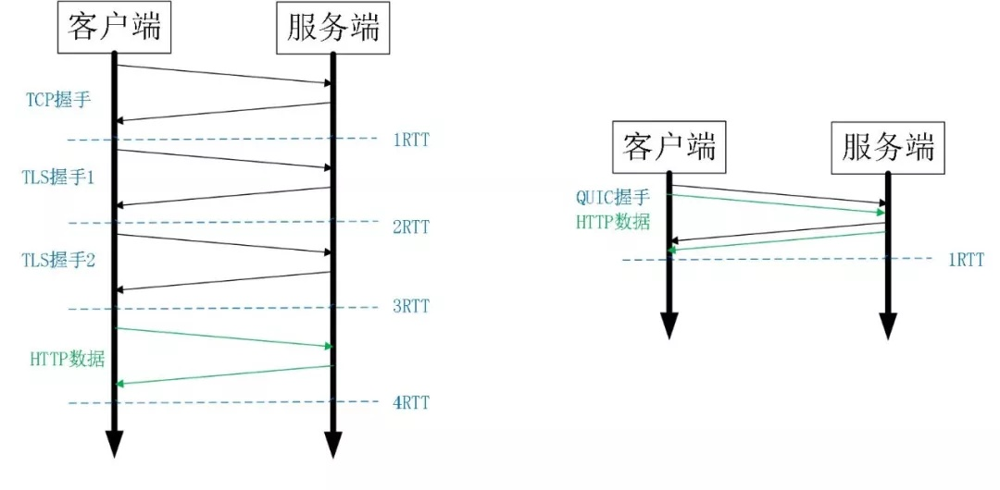

# What
**快速UDP网络连接（Quick UDP Internet Connections，QUIC）**

是一种实验性的传输层网络传输协议，由Google开发，在2013年实现。QUIC使用UDP协议，它在两个端点间创建连线，且支持多路复用连线。在设计之初，QUIC希望能够提供等同于SSL/TLS层级的网络安全保护，减少数据传输及创建连线时的延迟时间，双向控制带宽，以避免网络拥塞。Google希望使用这个协议来取代TCP协议，使网页传输速度加快。2018年10月，IETF的HTTP及QUIC工作小组正式将基于QUIC协议的HTTP（HTTP over QUIC）重命名为HTTP/3以为确立下一代规范做准备。

# Feature

compared with HTTP2+TCP+TLS

- 无TCP握手及TLS握手-->快
- 改进的拥塞控制
- 避免队头阻塞的多路复用
- 前向冗余纠错

# Reason

- 中间设备僵化（防火墙，NAT等硬件设备固话443，80端口，NAT擦写地址，抛弃不认识的选项字段等旧规则）
- 依赖操作系统实现导致的协议僵化（依赖底层TCP很难快迭代）
- 建立连接的握手延迟大（HTTPS/2 use TSL 使得TCP，TLS握手时间较长）
- 队头阻塞（序号顺序接受，前面丢了后面接受直接丢弃）

# Why

## RTT

0RTT (0次Round-Trip Time,0次往返)建连可以说是 QUIC 相比 HTTP2 最大的性能优势。那什么是 0RTT 建连呢？这里面有两层含义。

1. 传输层 0RTT 就能建立连接。
2. 加密层 0RTT 就能建立加密连接。

> 一个完整的 TLS 握手需要两次：
>
> 1. Client 发送 ClientHello；Server 回复 ServerHello
> 2. Client 回复最终确定的 Key，Finished；Server 回复 Finished
> 3. 握手完毕，Client 发送加密后的 HTTP 请求；Server 回复加密后的 HTTP 响应
>
> TLS Session Resumption
>
> 1. Client 发送 ClientHello（包含 Session ID）；Server 回复 ServerHello 和 Finished
> 2. 握手完毕，Client 发送加密后的 HTTP 请求；Server 回复加密后的 HTTP 响应
>
> TLS 0RTT
>
> 0 RTT 是 TLSv1.3 的可选功能。客户端和服务器第一次建立会话时，会生成一个 PSK（pre-shared key）。服务器会用 ticket key 去加密 PSK，作为 Session Ticket 返回。 客户端再次和服务器建立会话时，会先用 PSK 去加密 HTTP 请求，然后把加密后的内容发给服务器。服务器解密 PSK，然后再用 PSK 去解密 HTTP 请求，并加密 HTTP 响应。
>
>  HTTPS 握手已经跟 HTTP 请求合并到一起
>
> ​	1.Client 发送 ClientHello（包含 PSK）和加密后的 HTTP 请求；Server 回复 ServerHello 和 Finished 和加密后的 HTTP 响应。

## congestion control

TCP采用了

- 慢启动
- 拥塞避免
- 快重传
- 快恢复

QUCI默认支持Cubic，另外支持CubicBytes,Reno,RenoBytes,BBR,PCC

## Pluggable

可插拔，即灵活生效不需要重启或改变底层

- 应用层实现不同的拥塞控制算法，不需要底层支持
- 单个应用程序的不同连接支持不同的拥塞控制，如BBR，Cubic
- 应用程序无需变动直接变更拥塞控制，reload生效

STGW在配置层面进行了优化，针对不同业务，不同网络芝士，不同RTT，使用不同拥塞控制

## 单递增的Packet Number

为了保障TCP的可靠性，使用Seq（sequenceNumber 序号）和ack来确认,N丢失，重传N（问题：N如果重传两次，收到一个ACK，不知道是哪个的ACK）

QUIC使用PacketNumber代替seq，并且packetnumber严格递增，也就是说就算 Packet N 丢失了，重传的 Packet N 的 Packet Number 已经不是 N，而是一个比 N 大的值,另外支持Stream offset更好支持多个packet传输

## 不允许Reneging

reneging：TCP通信时，如果发送序列中间某个数据包丢失，TCP会通过重传最后确认的包开始的后续包，这样原先已经正确传输的包也可能重复发送，急剧降低了TCP性能。

为改善这种情况，发展出SACK(Selective Acknowledgment, 选择性确认)技术，使TCP只重新发送丢失的包，不用发送后续所有的包，而且提供相应机制使接收方能告诉发送方哪些数据丢失，哪些数据重发了，哪些数据已经提前收到等

QUIC禁止reneging

## 更多的ack块

TCP 的 Sack 选项能够告诉发送方已经接收到的连续 Segment 的范围，方便发送方进行选择性重传。

由于 TCP 头部最大只有 60 个字节，标准头部占用了 20 字节，所以 Tcp Option 最大长度只有 40 字节，再加上 Tcp Timestamp option 占用了 10 个字节 [25]，所以留给 Sack 选项的只有 30 个字节。

每一个 Sack Block 的长度是 8 个，加上 Sack Option 头部 2 个字节，也就意味着 Tcp Sack Option 最大只能提供 3 个 Block。

但是 Quic Ack Frame 可以同时提供 256 个 Ack Block，在丢包率比较高的网络下，更多的 Sack Block 可以提升网络的恢复速度，减少重传量。

## ack delay时间

收到客户端请求到响应的过程时间成为ack delay,QUIC的RTT需要减掉ack delay（计算我是没看懂。。。）

## 基于stream和connection级别的流量控制

作用：

- stream可以认为是一条HTTP请求
- Connection可以类比一条TCP连接，在connection上存在多条stream

tcp承载多个http请求

1. window_update告诉对方自己接受的字节数
2. blockFrame告诉对方由于流量控制被阻塞，无法发送数据
3. stream可用窗口=最大窗口数-收到的最大偏移数
4. connection可用窗口=$\sum$streams可用窗口

## 没有队头阻塞的多路复用

QUIC 的多路复用和 HTTP2 类似。在一条 QUIC 连接上可以并发发送多个 HTTP 请求 (stream)。但是 QUIC 的多路复用相比 HTTP2 有一个很大的优势。

QUIC 一个连接上的多个 stream 之间没有依赖。这样假如 stream2 丢了一个 udp packet，也只会影响 stream2 的处理。不会影响 stream2 之前及之后的 stream 的处理。

这也就在很大程度上缓解甚至消除了队头阻塞的影响。

HTTP2 在一个 TCP 连接上同时发送 4 个 Stream。其中 Stream1 已经正确到达，并被应用层读取。但是 Stream2 的第三个 tcp segment 丢失了，TCP 为了保证数据的可靠性，需要发送端重传第 3 个 segment 才能通知应用层读取接下去的数据，虽然这个时候 Stream3 和 Stream4 的全部数据已经到达了接收端，但都被阻塞住了。

不仅如此，由于 HTTP2 强制使用 TLS，还存在一个 TLS 协议层面的队头阻塞 

Record 是 TLS 协议处理的最小单位，最大不能超过 16K，一些服务器比如 Nginx 默认的大小就是 16K。由于一个 record 必须经过数据一致性校验才能进行加解密，所以一个 16K 的 record，就算丢了一个字节，也会导致已经接收到的 15.99K 数据无法处理，因为它不完整。

那 QUIC 多路复用为什么能避免上述问题呢？

1. QUIC 最基本的传输单元是 Packet，不会超过 MTU 的大小，整个加密和认证过程都是基于 Packet 的，不会跨越多个 Packet。这样就能避免 TLS 协议存在的队头阻塞。
2. Stream 之间相互独立，比如 Stream2 丢了一个 Pakcet，不会影响 Stream3 和 Stream4。不存在 TCP 队头阻塞。

当然，并不是所有的 QUIC 数据都不会受到队头阻塞的影响，比如 QUIC 当前也是使用 Hpack 压缩算法 [10]，由于算法的限制，丢失一个头部数据时，可能遇到队头阻塞。

总体来说，QUIC 在传输大量数据时，比如视频，受到队头阻塞的影响很小。

## 加密认证的报文

TCP 协议头部没有经过任何加密和认证，所以在传输过程中很容易被中间网络设备篡改，注入和窃听。比如修改序列号、滑动窗口。这些行为有可能是出于性能优化，也有可能是主动攻击。

但是 QUIC 的 packet 可以说是武装到了牙齿。除了个别报文比如 PUBLIC_RESET 和 CHLO，所有报文头部都是经过认证的，报文 Body 都是经过加密的。

这样只要对 QUIC 报文任何修改，接收端都能够及时发现，有效地降低了安全风险。

## 连接迁移

一条 TCP 连接 [17] 是由四元组标识的（源 IP，源端口，目的 IP，目的端口）,当其中任何一个元素发生变化时，这条连接依然维持着，能够保持业务逻辑不中断

比如大家使用手机在 WIFI 和 4G 移动网络切换时，客户端的 IP 肯定会发生变化，需要重新建立和服务端的 TCP 连接。

又比如大家使用公共 NAT 出口时，有些连接竞争时需要重新绑定端口，导致客户端的端口发生变化，同样需要重新建立 TCP 连接。

针对 TCP 的连接变化，MPTCP[5] 其实已经有了解决方案，但是由于 MPTCP 需要操作系统及网络协议栈支持，部署阻力非常大，目前并不适用。

所以从 TCP 连接的角度来讲，这个问题是无解的。

那 QUIC 是如何做到连接迁移呢？很简单，任何一条 QUIC 连接不再以 IP 及端口四元组标识，而是以一个` 64 位的随机数`作为 ID 来标识，这样就算 IP 或者端口发生变化时，只要 ID 不变，这条连接依然维持着，上层业务逻辑感知不到变化，不会中断，也就不需要重连。

由于这个 ID 是客户端随机产生的，并且长度有 64 位，所以冲突概率非常低。

## 其他

此外，QUIC 还能实现前向冗余纠错，在重要的包比如握手消息发生丢失时，能够根据冗余信息还原出握手消息。

QUIC 还能实现证书压缩，减少证书传输量，针对包头进行验证等。

