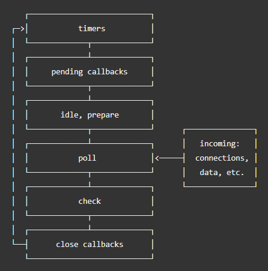

# What

eventloop使得单线程机制的node实现非阻塞I/O的机制，将任务通过libuv分发给线程池后，交由系统内核完成（多线程），完成后内核通知nodejs，将回调放入`poll`队列执行

启动nodejs时，eventloop初始化，进程会输入很多script，包括：

- async API calls
- 定时器
- process.nextTick()



eventloop有六个队列

- timers
- pending callbacks
- idle,prepare
- poll(connections,data,etc)
- check
- close callbacks

这些队列被称作phase,每个phase都是一个可以放callback的FIFO队列，当进入一个phase时，队列将执行完phase中的callback或者执行最大数目的callback后将进入另一个phase

- timers：执行定时器，包括setTimeout，setInerval
- pending callbacks 执行延迟到下一个循环的I/O callback
- idle，prepare 处理系统内部
- poll：检查新的I/O事件，执行I/O回调,node会适当的在此阻塞
- check:setImmediate()
- close：关闭回调函数，如：socket.on('close',foo())

# Detail

## Timers

设定延迟后，timers会在规定的时间执行，但存在情况延迟，如`poll` phase执行回调，超过了timer设定的时间。因为poll必须完成一个任务后才可以检查最近的定时器，没到时间就执行下一个callback，执行callback期间无法中断

> 可以得出结论：`poll`控制着定时器何时执行

另外为了防止poll phase 变成恶汉，libuv 制定了一个依赖于系统的硬性最大值，来停止轮询获取更多事件


## pending callbacks

该队列在系统错误时执行回调（如TCP err），如TCP socket尝试重连收到了`ECONNREFUSED`，系统需要这些错误报告，那这个错误报告回调就会放在pending callbacks中等待被执行

## poll

最重要的阶段，poll主要包含两个功能：

1. 计算阻塞和轮询的IO时间

2. 执行poll 队列里的events

当eventloop进入`poll`阶段，并没有timers的时候

- `poll`不为空，顺序同步执行任务，直到为空或达到处理数量上限
- `poll`为空：如果有setImmediate()，则进入`check phase`，反之就在`poll`等客人

一但`poll`为空，eventlopp将会检查计时器是否有快到的，如果有需要执行的，eventloop将要进入`timers`阶段来顺序执行timer callback

## check

这个phase可以在`poll`执行完成时开始执行setImmediate()回调。他其实是特殊的定时器队列，**使用libuv API在poll完成的阶段执行**（这也是他存在的原因）。

## close callbacks

socket.desroy()等执行关闭event时候会进入该phase，否则会被process.nextTick()触发

# setImmedate() vs setTimeout()

相似却又不同

- setImmediate()是poll执行完成后执行的script
- setTimeout()是定时执行的

执行哪个收到上下文的约束，如果两个都被主模块调用，那么进程性能将会收到约束（影响其他app运行）

```
without IO
setTimeout(() => {
  console.log('timeout');
}, 0);

setImmediate(() => {
  console.log('immediate');
});
//
$ node timeout_vs_immediate.js
timeout
immediate

$ node timeout_vs_immediate.js
immediate
timeout

with IO
// timeout_vs_immediate.js
const fs = require('fs');

fs.readFile(__filename, () => {
  setTimeout(() => {
    console.log('timeout');
  }, 0);
  setImmediate(() => {
    console.log('immediate');
  });
});
//
immediate
timeout
```

setImmediate()好处在于，如果有IO时会比setTimeout先执行

## process.nextTick()

它是个异步API，并没有出现在六个phase中，他并不属于eventloop的一部分，当操作完成后处理nextTickQueue而不管eventloop执行到哪个阶段，这个异步API依赖于C/C++处理 JavaScript

他的callbakcs会立即执行，**直到执行完**，eventloop才会正常工作（如果nextTick递归调用则会死循环）

为什么会出现这种设计？

出于所有**接口都应该异步**的设计思路

```
function apiCall(arg, callback) {
  if (typeof arg !== 'string')
    return process.nextTick(callback,
                            new TypeError('argument should be string'));
}
```

代码段会校验参数，如果不正确，它将会把错误传递给回调。该API最近更新，允许传任何参给process.nextTick(),所以你不需要嵌套。仅在剩余代码执行之后我们会把错误反馈给用户，通过nextTick，我们保证`apiCal()`始终在用户胜于代码之后及eventloop继续之前，执行。为了达到这个目标，JS栈内存允许展开并且立即执行提供的callback，似的nextTick递归不会有报错。

### process.nextTick() vs setImmediate()

- process.nextTick()立刻执行
- setImmediate()下次tick执行

为什么需要process.nextTick()

- 允许用户处理errors，清理不需要的资源，事件循环前 尝试重新连接
- 有时有必要在eventloop继续之前，在call stack unwound之后，让callback执行

```
const server = net.createServer();
server.on('connection', (conn) => { });

server.listen(8080);
server.on('listening', () => { });
```

listen()的callback调用的是setImmiate()，除非传递Hostname，否则立即绑定端口。为了保证eventloop继续，他必须进入`poll` phase，这意味着，存在可能已经收到了连接，从而允许在侦听事件之前触发连接事件