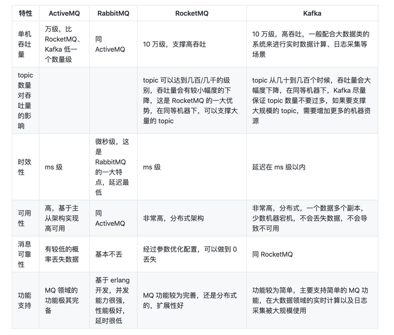

# what

MQ-message queue

三足鼎立

rocketmq:rocket: -Made by Java 吞吐量高一些 阿里中间件

rabbitmq:rabbit:  -Made by Erlang

Kafka



以后有更多的了解再补充性能/功能差距

# why

功能：解耦(双方通过mq交互)、异步、削峰

应用：

- 阿里双11


问题：

- 处理好新增的复杂性
- 处理好系统可用性

# how

## 1.docker run

Because of rocketmq need more than 

```shell
docker pull rabbitmq:management

docker run -dit --name rabbitmq -e RABBITMQ_DEFAULT_USER=admin -e RABBITMQ_DEFAULT_PASS=admin -p 15672:15672 -p 5672:5672 rabbitmq:management

--name containername
-e RABBITMQ_DEFAULT_USER 参数用户名，密码同理
-p 端口映射，主机：容器，15672-UI，5672-service
rabbitmq:management image's name

```

## 2.Usage

1.open chrome and input 'localhost:15672' or '192.168.1.1:15672' then you can touch rabbitmq UI

Overview--the queued msg, msg rate in your server,  some global counts, your nodes stats (if u use the above method,you only see one node in the screen ),you also can build a cluster with more nodes

Connections--

Channels--

Exchanges--direct,fanout,headers,match,trace,topic

Queses--

Admin--users management with passport && permission


2.use 5672 in your code

```javascript
amqp.connect({
            protocol: 'amqp',
            hostname: 'example.com',//localhost
            port: '5672',
            username: 'admin',
            password: 'xxx',
            vhost: '/',//important
        })
```

more in official docs-->[ I'm doc](https://www.rabbitmq.com/tutorials/tutorial-one-javascript.html)

or some blogs-->[I'm blog](https://www.cnblogs.com/wukong-holmes/p/9306733.html)

or my GitHub-->[click here](https://github.com/ShawnGoethe/phones/tree/master/app/controller/pmq.jsÏ)


