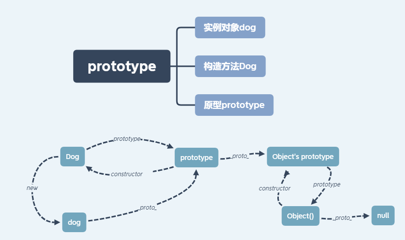

# Prototype

含义：proto（/ˈproʊtə/）原始, 原型, 原始的

目的：补充JavaScript对于对象的支持，通过protype来实现class中的method

过程：熟悉实例对象<--->构造函数<--->原型 三者之间的关系

```js
//构造函数 创建对象
function Dog() {

}
var dog = new Dog();//Person 为构造函数,person为实例对象
dog.name = '柯基';
console.log(dog.name) // 柯基
```

- 构造函数通过prototype访问原型（一个类的属性，对象都可以访问）
- 实例对象通过 `_proto_` 访问原型 === 构造函数通过`prototype`访问原型（原型也有`_proto_`）
- 实例原型通过`constructor`访问构造函数(Dog=== Dog.prototype.constructor)



- 原型遵循向上原则，即找不到就不断向上（prototype）查询
- 原型因为不停延长形成链，称作原型链，但是  `Object.prototype.__proto__` 的值为 null 跟 Object.prototype 没有原型
- 原型链大概实现了类（Class）以及继承（Extend）的问题，但它并不是复制，是建立一种关联，通过`prototype`/`_proto_` 来访问其他对象的属性和方法，属于委托/借用

# Extend

一共分为6种

- 原型链继承
- 借用构造函数（经典继承）
- 组合继承
- 原型式继承
- 寄生式继承
- 寄生组合式继承

## 原型链继承

```js
function Parent () {
    this.names = ['kevin', 'daisy'];
}
function Child () {}
Child.prototype = new Parent();

var child1 = new Child();

child1.names.push('yayu');

console.log(child1.names); // ["kevin", "daisy", "yayu"]

var child2 = new Child();

console.log(child2.names); // ["kevin", "daisy", "yayu"]
```

问题：

- 属性被所有child共享
- 创建child实例时，不能向parent传参

## 借用构造函数

```js
function Parent (name) {
    this.name = name;
}

function Child (name) {
    Parent.call(this, name);
}

var child1 = new Child('kevin');

console.log(child1.name); // kevin

var child2 = new Child('daisy');

console.log(child2.name); // daisy
```

有点：

- 避免引用类型的属性被所有实例共享
- 可以在Child中间parent传参

缺点：

- 方法在构造函数中定义，每次创建势力都会创建一遍方法

## 组合继承

以上两种方法的组合,为最常用的继承方式

```js
function Parent (name) {
    this.name = name;
    this.colors = ['red', 'blue', 'green'];
}

Parent.prototype.getName = function () {
    console.log(this.name)
}

function Child (name, age) {
    Parent.call(this, name);
    this.age = age;
}

Child.prototype = new Parent();
Child.prototype.constructor = Child;

var child1 = new Child('kevin', '18');

child1.colors.push('black');
console.log(child1.name); // kevin
console.log(child1.age); // 18
console.log(child1.colors); // ["red", "blue", "green", "black"]

var child2 = new Child('daisy', '20');

console.log(child2.name); // daisy
console.log(child2.age); // 20
console.log(child2.colors); // ["red", "blue", "green"]
```

